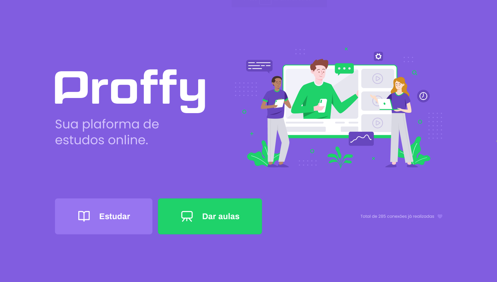

<h1 align="center">
    
</h1>

<h4 align="center"> 
	:heavy_check_mark: NextLevelWeek 2.0 🚀 Done! :heavy_check_mark:
</h4>
<p align="center">
</p>
<p align="center">
  <a href="#information_source-whats-next-level-week">Next Level Week</a>&nbsp;&nbsp;&nbsp;|&nbsp;&nbsp;&nbsp;
  <a href="#-project">Project</a>&nbsp;&nbsp;&nbsp;|&nbsp;&nbsp;&nbsp;
  <a href="#rocket-Technologies">Technologies</a>&nbsp;&nbsp;&nbsp;|&nbsp;&nbsp;&nbsp;
  <a href="#information_source-how-to-use">How to use</a>&nbsp;&nbsp;&nbsp;|&nbsp;&nbsp;&nbsp;
  <a href="#memo-license">License</a>
</p>

## :information_source: What's Next Level Week?

NLW is an online and free event, with lots of code, challenges, networking and a single goal: to take you to the next level.

### Days

- Day 1: Accelerating its evolution 03/08 :heavy_check_mark:
- Day 2: Looking for opportunities 04/08 :heavy_check_mark:
- Day 3: The stack choice 05/08 :heavy_check_mark:
- Day 4: Up to 2 years in 2 months 06/08 :heavy_check_mark:
- Day 5: Extra mile 07/08 :heavy_check_mark:

## 💻 Project

Proffy is an online study platform that allows you to connect students and teachers. Teachers can choose the subjects, the price, the day of the week and the period to teach. Students can filter by subject, day of the week and time.

<h1 align="center">
    
</h1>

## :rocket: Technologies

This project was developed with the following technologies:

- [Node.js][nodejs]
- [TypeScript][typescript]
- [React][reactjs]
- [React Native][rn]
- [Expo][expo]

<a target="_blank" href="https://nodejs.org">
  
</a>
<a target="_blank" href="https://www.typescriptlang.org/">
  
</a>
<a target="_blank" href="https://reactjs.org/">
  
</a>
<a target="_blank" href="https://reactnative.dev/">
  
</a>
<a target="_blank" href="https://expo.io/">
  
</a>
<br>

## :information_source: How To Use

To clone and run each module, you will need to have the following applications installed on your computer: [Git](https://git-scm.com), [Node.js][nodejs] and [Yarn][yarn].

### Install API

```bash
# Clone this repository
$ git clone https://github.com/adrianog3/proffy-NLW-2.0

# Go into the repository
$ cd proffy-NLW-2.0/server

# Install dependencies
$ yarn install

# Run migrations
$ yarn knex:migrate

# Start server
$ yarn start

# running on port 3333
```

### Install web

```bash
# Clone this repository
$ git clone https://github.com/adrianog3/proffy-NLW-2.0

# Go into the repository
$ cd proffy-NLW-2.0/web

# Install dependencies
$ yarn install

# Run
$ yarn start

# running on port 3000
```

### Install Mobile

```bash
# Clone this repository
$ git clone https://github.com/adrianog3/proffy-NLW-2.0

# Go into the repository
$ cd proffy-NLW-2.0/mobile

# Install dependencies
$ yarn install

# Run
$ yarn start

# Expo will open, just scan the qrcode on terminal or expo page

# If some problem with fonts, execute:
$ expo install expo-font @expo-google-fonts/archivo @expo-google-fonts/poppins

```

## :memo: License

This project is under the MIT license. See the [LICENSE](https://github.com/adrianog3/proffy-NLW-2.0/blob/master/LICENSE) for details.

Made with ♥ by Adriano Souza :wave: [Get in touch](https://www.linkedin.com/in/adrianog3/)

[nodejs]: https://nodejs.org/
[typescript]: https://www.typescriptlang.org/
[expo]: https://expo.io/
[reactjs]: https://reactjs.org
[rn]: https://facebook.github.io/react-native/
[yarn]: https://yarnpkg.com/
